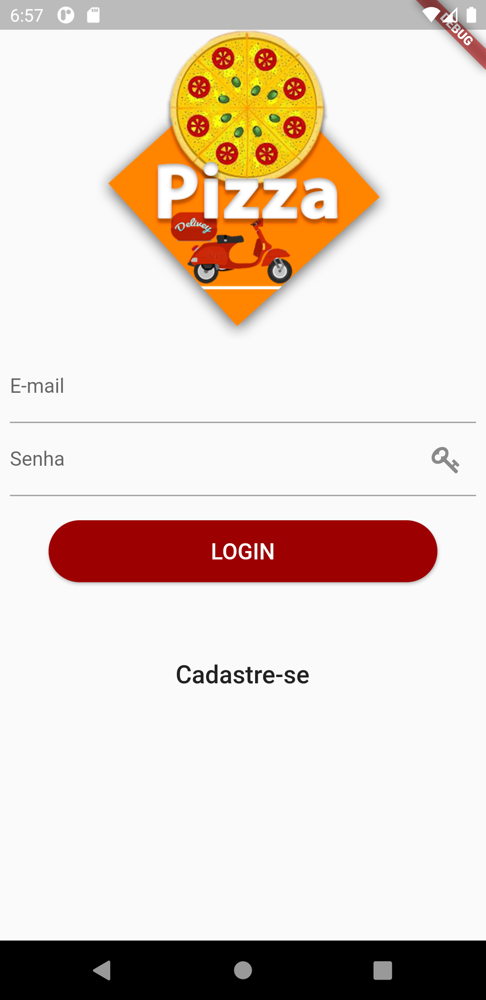
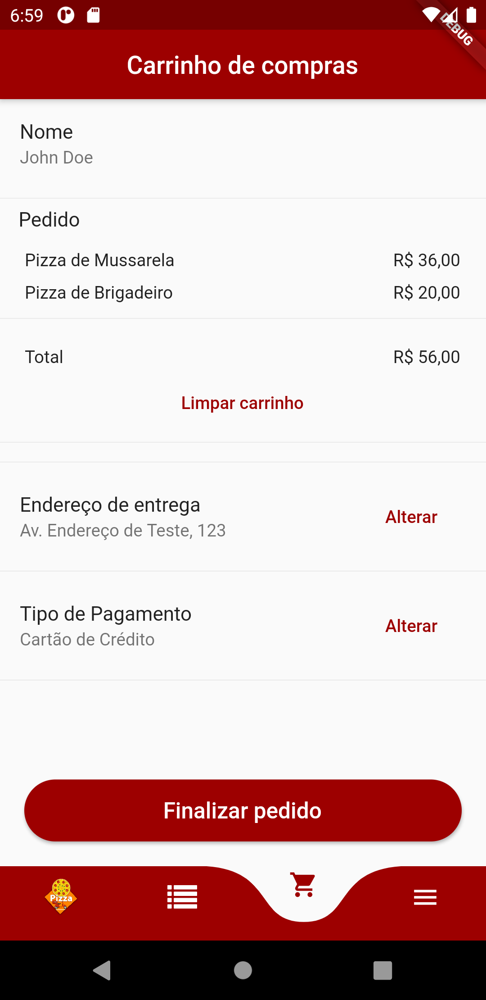

# Pizza Delivery App

This application was developed as part of the Dart Week 2.0 content, created by Rodrigo Rahman. This repository is related to the mobile application which will be consuming an API developed also using Dart (https://github.com/bmsrangel/dart_week_2.0_backend) and, as the name suggests, it's an application to order pizzas and they will be delivery at a specific address.

P.S.: The application code is not 100% equal to the original videos code, due to personnal modifications and issues solving; however, the functionalities are the same.

 
 
 


## Used packages

This project uses the following packages and versions:

- [grouped_buttons](https://pub.dev/packages/grouped_buttons): ^1.0.4 (Checkboxes and Radio Buttons made easier)
- [intl](https://pub.dev/packages/intl): ^0.16.1 (Internacionalization and localization facilities)
- [curved_navigation_bar](https://pub.dev/packages/curved_navigation_bar): ^0.3.4 (Easy implementation of curved navigation bar)
- [dio](https://pub.dev/packages/dio): ^3.0.10 (Powerful HTTP Client for Dart)
- [flutter_icons](https://pub.dev/packages/flutter_icons): ^1.1.0 (Customizable icons for Flutter, inspired by react-native-vector-icons)
- [validators](https://pub.dev/packages/validators): ^2.0.1 (String validations and sanitizations for Dart)
- [shared_preferences](https://pub.dev/packages/shared_preferences): ^0.5.12 (Local data storage)
- [provider](https://pub.dev/packages/provider): ^4.3.2+2 (Efficient way to propagate information down the tree)

## Getting Started

**In order to run the application correctly, the backend must also be running either locally or in a remote server. The backend application code with usage instructions is linked above.**

Steps to run the application:

- Clone the repository
- Download the packages (`flutter pub get`)
- Run the application

**The debug mode does NOT reflect the actual performance of the application. So, in order the get a more consistent experience, it's recommended to run the application in an actual device either using the _profile version_ (`flutter run --profile`) or building the .apk file (`flutter build apk`) and installing it in the device.**```
